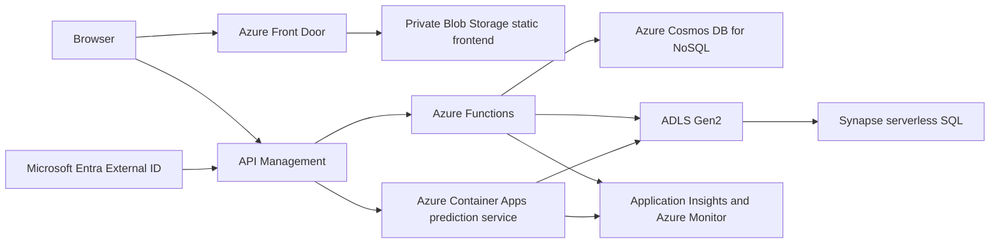

# Azure Migration Guide

This document describes how to run the Airbnb Pricing and Market Intelligence Platform on Microsoft Azure instead of AWS.

The existing implementation and deployment evidence remain AWS-specific. This guide is a target architecture and migration plan; it does not claim that the Azure version has been deployed or tested.

## Target architecture



## AWS to Azure mapping

| Current AWS component | Azure target | Notes |
|---|---|---|
| Private S3 frontend origin | Private Azure Blob Storage with Azure Front Door | Preserve HTTPS, private origin access, SPA fallback, and cache rules. |
| API Gateway HTTP API | Azure API Management | Use it for routing, CORS, JWT validation, throttling, and safe response policies. |
| Health, history, analytics, and chat Lambdas | Azure Functions HTTP triggers | Port the Python handlers and replace AWS Lambda proxy assumptions with the Azure Functions programming model. |
| Containerized prediction Lambda | Azure Container Apps | A better fit for the scientific Python model image and its memory/cold-start requirements. Functions Premium is an alternative. |
| Cognito | Microsoft Entra External ID | Use OIDC/OAuth2 authorization-code flow with PKCE. Retest email verification, MFA, redirect URLs, token claims, and logout. |
| DynamoDB | Azure Cosmos DB for NoSQL | Partition by `user_id`; use conditional writes for idempotency and TTL where appropriate. |
| Private S3 data lake | ADLS Gen2 | Use hierarchical namespace, private access, RBAC, lifecycle rules, and encryption. |
| Glue transformation | Azure Data Factory, Synapse Spark, or a scheduled Function | Select based on data volume and schedule. For this small dataset, a scheduled Function may be the lowest-complexity option. |
| Glue Data Catalog and Athena | Synapse serverless SQL | Keep analytics queries fixed and approved instead of accepting arbitrary SQL from users. |
| ECR | Azure Container Registry | Use managed identity pulls, immutable image tags, retention, and vulnerability scanning. |
| CloudWatch | Application Insights, Log Analytics, Azure Monitor, Workbooks, and Action Groups | Preserve structured logs, metrics, dashboards, alerts, and operator notifications. |
| S3 Terraform backend | Azure Blob Storage Terraform backend | Use a private, versioned state container and blob lease locking. |
| Bedrock chat | Azure OpenAI or Microsoft Foundry | Optional for V1. Retain the bounded prompt, user-scoped context, protected route, and response limit. |

## Recommended migration order

1. Create a separate Azure resource group and configure a region, naming convention, tags, and budgets.
2. Provision ADLS Gen2, Cosmos DB, Container Registry, Application Insights, and Microsoft Entra External ID.
3. Deploy the static frontend to private Blob Storage and expose it through Front Door.
4. Port `GET /health` to Azure Functions and put it behind API Management.
5. Port the prediction service to Container Apps and verify model loading, latency, memory use, and scaling.
6. Port history and idempotency persistence from DynamoDB to Cosmos DB.
7. Port the fixed analytics workflow to ADLS Gen2 and Synapse serverless SQL, Data Factory, or a scheduled Function.
8. Port chat only after prediction, history, and analytics work correctly.
9. Replace AWS Terraform resources with Azure Terraform resources and configure GitHub Actions OIDC federation with Microsoft Entra.
10. Repeat functional, security, load, resilience, and recreation tests against Azure. Store new results as Azure evidence rather than renaming AWS evidence.

## Application changes

### Backend

Replace AWS-specific SDK and event handling in these areas:

- `src/backend/predict/handler.py`: expose the model through Container Apps or an Azure Functions-compatible endpoint.
- `src/backend/history/handler.py`: use the Cosmos DB SDK and derive the partition key from the verified token subject.
- `src/backend/analytics/handler.py`: call a fixed query or read a precomputed analytics result from ADLS Gen2.
- `src/backend/chat/handler.py`: replace Bedrock calls with Azure OpenAI or Microsoft Foundry if chat is retained.
- All handlers: return Azure-compatible HTTP responses, validate inputs, and avoid exposing stack traces or internal details.

### Frontend

Update `src/frontend/auth.js` and runtime configuration to use the Entra External ID authority, client ID, API scope, redirect URI, and logout URI. Do not place client secrets in frontend files.

The frontend API base URL should come from deployment configuration rather than being hardcoded to an AWS API Gateway URL.

### Analytics and machine learning

Keep the existing reproducible preprocessing and model artifact format where possible. Move raw, processed, model, and analytics artifacts to separate ADLS Gen2 paths. Preserve the existing city partitioning and document the limitations of using listing availability as a demand proxy.

Do not claim improved model accuracy until the Azure-hosted model has been evaluated using the same MAE, RMSE, and R-squared process as the current implementation.

## Security design

- Use Microsoft Entra External ID and validate JWTs at API Management and the backend boundary.
- Derive the history user from the verified token subject, never from a caller-supplied user ID.
- Use managed identities and Azure RBAC instead of credentials in source code or Terraform variables.
- Keep Blob Storage, ADLS Gen2, Cosmos DB, and Container Registry private where practical.
- Use strict CORS, HTTPS, input validation, safe JSON errors, and route-level throttling.
- Store secrets that are genuinely required in Azure Key Vault.
- Use private endpoints only when their DNS, subnet, and operating cost are justified.
- Keep analytics access to approved operations; never accept arbitrary SQL from the browser.
- Configure Application Insights, Log Analytics, alerts, and diagnostic settings without logging tokens, credentials, or personal data.

## Infrastructure and CI/CD

Create a separate Azure Terraform root rather than mechanically editing the AWS modules under `src/infrastructure`. The Azure root should include modules for:

- resource group and naming
- storage and Front Door
- API Management and Functions
- Container Apps and Container Registry
- Cosmos DB
- ADLS Gen2 and analytics
- Entra External ID integration configuration
- monitoring and alerts
- GitHub Actions federated identity and role assignments

Use the `azurerm` Terraform provider and an Azure Blob backend. Keep state private, versioned, and protected from accidental deletion. Use GitHub OIDC federation with Microsoft Entra rather than long-lived Azure client secrets.

The CI/CD workflow should run unit tests, Python compilation, frontend syntax checks, dependency and secret scans, Terraform formatting and validation, then require an explicit protected-environment approval before applying infrastructure.

## Validation checklist

Run the following checks for the Azure implementation:

- `python -m unittest discover -s tests -p "test_*.py" -v`
- `terraform fmt -check`
- `terraform validate`
- API smoke tests for health, prediction, analytics, history, and chat
- Entra sign-in, token validation, logout, and user-isolation tests
- Cosmos DB idempotency and partition-key tests
- model cold-start, warm-latency, memory, and scale-out tests
- frontend HTTPS, CORS, cache, and SPA routing checks
- OWASP ZAP baseline scan against the Azure HTTPS endpoint
- load and throttling tests using Azure quotas and scaling behavior
- infrastructure recreation and cleanup test in a separate resource group

Report Azure results with dates, regions, SKUs, and redacted outputs. Do not reuse AWS deployment, performance, or resilience results as Azure evidence.

## Cost and design trade-offs

- API Management provides useful gateway controls but adds recurring cost. Direct Functions access is cheaper for a very small deployment but provides less centralized policy control.
- Cosmos DB requires an explicit request-unit or serverless capacity choice and a deliberate partition key.
- Synapse serverless SQL and Data Factory may cost more than precomputing the small city summary. Compare both approaches before choosing.
- Container Apps avoids many Lambda packaging constraints but introduces revision, ingress, scaling, and managed-environment configuration.
- Private endpoints improve isolation but add networking, DNS, and operational complexity.
- Azure service availability, quotas, and pricing vary by region and subscription. Record the selected region and SKU in the deployment evidence.

## Provisioning the Azure VM with Terraform

The Terraform currently used by this project provisions AWS resources. Do not run it with an Azure subscription or simply change the provider block. The Azure VM Terraform root is `azure-infrastructure/azure-vm/` and uses the `azurerm` provider.

Terraform should create the VM, network, public IP, and NSG rule for HTTP. It should not contain private SSH keys or GitHub tokens. Copy or clone the source code after Terraform has created the VM.

A minimal Azure VM Terraform root contains resources equivalent to these:

```hcl
terraform {
    required_version = ">= 1.6.0"

    required_providers {
        azurerm = {
            source  = "hashicorp/azurerm"
            version = "~> 4.0"
        }
    }
}

provider "azurerm" {
    features {}
    subscription_id = var.subscription_id
}

resource "azurerm_resource_group" "app" {
    name     = var.resource_group_name
    location = var.location
}

resource "azurerm_virtual_network" "app" {
    name                = "${var.vm_name}-vnet"
    location            = azurerm_resource_group.app.location
    resource_group_name = azurerm_resource_group.app.name
    address_space       = ["10.20.0.0/16"]
}

resource "azurerm_subnet" "app" {
    name                 = "default"
    resource_group_name  = azurerm_resource_group.app.name
    virtual_network_name = azurerm_virtual_network.app.name
    address_prefixes     = ["10.20.1.0/24"]
}

resource "azurerm_public_ip" "app" {
    name                = "${var.vm_name}-pip"
    location            = azurerm_resource_group.app.location
    resource_group_name = azurerm_resource_group.app.name
    allocation_method   = "Static"
    sku                 = "Standard"
}

resource "azurerm_network_security_group" "app" {
    name                = "${var.vm_name}-nsg"
    location            = azurerm_resource_group.app.location
    resource_group_name = azurerm_resource_group.app.name

    security_rule {
        name                       = "Allow-SSH-From-Admin"
        priority                   = 1000
        direction                  = "Inbound"
        access                     = "Allow"
        protocol                   = "Tcp"
        source_port_range          = "*"
        destination_port_range     = "22"
        source_address_prefix      = var.admin_cidr
        destination_address_prefix = "*"
    }

    security_rule {
        name                       = "Allow-HTTP"
        priority                   = 1010
        direction                  = "Inbound"
        access                     = "Allow"
        protocol                   = "Tcp"
        source_port_range          = "*"
        destination_port_range     = "80"
        source_address_prefix      = "Internet"
        destination_address_prefix = "*"
    }
}

resource "azurerm_network_interface" "app" {
    name                = "${var.vm_name}-nic"
    location            = azurerm_resource_group.app.location
    resource_group_name = azurerm_resource_group.app.name

    ip_configuration {
        name                          = "primary"
        subnet_id                     = azurerm_subnet.app.id
        private_ip_address_allocation = "Dynamic"
        public_ip_address_id          = azurerm_public_ip.app.id
    }
}

resource "azurerm_network_interface_security_group_association" "app" {
    network_interface_id      = azurerm_network_interface.app.id
    network_security_group_id = azurerm_network_security_group.app.id
}

resource "azurerm_linux_virtual_machine" "app" {
    name                            = var.vm_name
    resource_group_name             = azurerm_resource_group.app.name
    location                        = azurerm_resource_group.app.location
    size                            = var.vm_size
    admin_username                  = var.admin_username
    disable_password_authentication = true
    network_interface_ids           = [azurerm_network_interface.app.id]

    admin_ssh_key {
        username   = var.admin_username
        public_key = var.admin_ssh_public_key
    }

    os_disk {
        caching              = "ReadWrite"
        storage_account_type = "Standard_LRS"
    }

    source_image_reference {
        publisher = "Canonical"
        offer     = "ubuntu-24_04-lts"
        sku       = "server"
        version   = "latest"
    }
}

output "public_ip" {
    value = azurerm_public_ip.app.ip_address
}
```

The working version of this configuration is in `azure-infrastructure/azure-vm/`. Copy its `terraform.tfvars.example` to a local, uncommitted `terraform.tfvars` and replace every placeholder. Keep `admin_cidr` restricted to the administrator's public IP in CIDR form, such as `203.0.113.10/32`.

Run the Azure Terraform root from a machine with Azure CLI authentication or another approved Azure credential:

```powershell
cd azure-infrastructure/azure-vm
az login
terraform init
terraform fmt -check
terraform validate
terraform plan -out tfplan
terraform apply tfplan
terraform output -raw public_ip
```

For shared or production state, configure an `azurerm` backend backed by a private, versioned Azure Storage container. Bootstrap that state storage separately before running `terraform init`; never commit `terraform.tfstate`, private `.tfvars`, credentials, or SSH private keys.

After apply, use the Terraform output to connect and transfer the source code:

```powershell
$publicIp = terraform output -raw public_ip
ssh -i "C:\path\to\INF2006_key.pem" azureuser@$publicIp
```

Terraform creates the infrastructure only. You still need to install Nginx, copy the frontend, create `config.js`, start the API adapter, and verify the site as described in the VM deployment section below. For repeatable application deployment, use GitHub Actions, cloud-init, or a configuration-management step after Terraform rather than adding private credentials to Terraform provisioners.

## Deploying the source code to an Azure VM

This is a simple VM-based deployment path for development or demonstration. It is separate from the recommended serverless Azure architecture above. A VM gives you an Azure-hosted Linux machine, but the existing AWS Lambda handlers still need an HTTP server or Azure service adapter before they can serve browser requests.

### 1. Create the VM

Create a resource group and Ubuntu VM in the Azure portal or with Azure CLI. For a small development VM, begin with a burstable general-purpose size such as `Standard_B2s`, then confirm that the size is available in the selected region and fits the subscription quota.

```powershell
$resourceGroup = "inf2006-azure-rg"
$location = "southeastasia"
$vmName = "inf2006-vm"
$adminUser = "azureuser"

az group create --name $resourceGroup --location $location
az vm create `
    --resource-group $resourceGroup `
    --name $vmName `
    --location $location `
    --image Ubuntu2404 `
    --size Standard_B2s `
    --admin-username $adminUser `
    --generate-ssh-keys `
    --public-ip-sku Standard `
    --nsg-rule SSH
```

In production, restrict the SSH network security group rule to the team member's public IP address only. Do not leave SSH open to the whole internet. Do not open HTTP or HTTPS until the application and TLS configuration are ready.

### 2. Get the public IP and connect

```powershell
$publicIp = az vm show -d `
    --resource-group $resourceGroup `
    --name $vmName `
    --query publicIps `
    --output tsv

ssh "$adminUser@$publicIp"
```

Accept the host key only after checking that the displayed IP belongs to the VM you created.

### 3. Install the VM dependencies

Run these commands after connecting through SSH:

```bash
sudo apt update
sudo apt upgrade -y
sudo apt install -y git python3 python3-venv python3-pip nginx
```

Use the repository's documented Python version and requirements. Do not install project dependencies globally. For the analytics and test dependencies, create separate virtual environments if their requirements differ.

### 4. Copy the repository to the VM

The preferred method is to clone from the repository rather than copy a working tree manually:

```bash
cd ~
git clone git@github.com:LumJiaJun/INF2006-Project.git INF2006-Project
cd ~/INF2006-Project
```

This clone command uses an SSH key on the Azure VM for GitHub authentication. It is different from the `.pem` private key used to connect from your Windows computer to the Azure VM. On the VM, create or install a GitHub-specific key, add its public key to the GitHub account or repository, and test it before cloning:

```bash
ssh-keygen -t ed25519 -C "azure-vm-github"
cat ~/.ssh/id_ed25519.pub
ssh -T git@github.com
```

If the repository is public, you can use HTTPS instead and avoid configuring a GitHub SSH key:

```bash
git clone https://github.com/LumJiaJun/INF2006-Project.git INF2006-Project
```

For a private repository, use an SSH deploy key or an approved GitHub authentication method. Do not put a personal access token in the clone URL, shell history, source code, or documentation.

If cloning is not suitable, use VS Code Remote - SSH to open the VM and upload files, or copy a local directory from PowerShell:

```powershell
scp -r .\src .\analytics .\tests .\README.md .\project_manifest.yaml `
    "$adminUser@$publicIp`:/home/$adminUser/INF2006-Project/"
```

Exclude `.git`, virtual environments, `.env` files, Terraform state, credentials, private keys, and large generated artifacts unless they are explicitly required.

### 5. Create a Python environment and run offline checks

```bash
cd ~/INF2006-Project
python3 -m venv .venv
source .venv/bin/activate
python -m pip install --upgrade pip
python -m pip install -r analytics/requirements.txt
python -m unittest discover -s tests -p "test_*.py" -v
```

Install backend-specific requirements from the relevant project file if one is added. The current tests and analytics scripts should be run before exposing any endpoint publicly.

### 6. Choose how the application runs

The existing project is split into a static frontend and AWS-oriented Lambda handlers. Choose one of these approaches:

- Serve the static frontend with Nginx, while moving API handlers to Azure Functions or Container Apps. This preserves the recommended architecture.
- Add a small ASGI or WSGI adapter around the Python prediction and API code, then run it with Gunicorn behind Nginx. This is a VM redesign and requires new application code and endpoint tests.
- Use the VM only for training, analytics, or development, and deploy the application components to their managed Azure services.

Do not assume that running `python handler.py` will provide a production HTTP service. Lambda event handlers need an adapter and production process management.

The current repository does not include that VM adapter. In particular, `src/backend/analytics/handler.py` is an AWS Lambda handler that calls Amazon Athena through `boto3`. Until it is replaced with an Azure-compatible service or a local VM adapter, `/api/analytics` will return `502` from Nginx because nothing is listening on `127.0.0.1:8000`.

For a complete Azure deployment, replace the Athena call with a fixed query against Synapse serverless SQL or serve a precomputed analytics JSON result from ADLS Gen2. Then expose that implementation through an HTTP service listening on `127.0.0.1:8000`, and verify it before reloading Nginx:

```bash
curl -i http://127.0.0.1:8000/analytics
curl -i http://127.0.0.1/api/analytics
```

The second command should return JSON, not a `502 Bad Gateway` response.

### 7. Serve a static frontend with Nginx, if applicable

The frontend expects two runtime files that were generated by the AWS Terraform deployment: `config.js` for the API base URL and `auth-config.js` for browser authentication. The VM deployment must provide these files explicitly. Do not put client secrets in either file.

If an API adapter is running on the same VM and listens on `127.0.0.1:8000`, create `config.js` with a relative API URL:

```bash
cat > /tmp/config.js <<'EOF'
window.APP_CONFIG = Object.freeze({ apiBaseUrl: "/api" });
EOF
```

The frontend can be served without `auth-config.js`, but sign-in, history, and protected chat will not work until Microsoft Entra External ID has been configured. Do not copy the old Cognito configuration into the Azure deployment.

After confirming which frontend directory is the deployable site, copy it and the runtime configuration to Nginx's web root:

```bash
sudo rm -rf /var/www/inf2006
sudo mkdir -p /var/www/inf2006
sudo cp -r src/frontend/. /var/www/inf2006/
sudo cp /tmp/config.js /var/www/inf2006/config.js
sudo chown -R www-data:www-data /var/www/inf2006
```

Create an Nginx site configuration with SPA fallback and an API reverse proxy:

```bash
sudo apt update
sudo apt install -y nginx
sudo install -d -m 0755 /etc/nginx/sites-available /etc/nginx/sites-enabled

sudo tee /etc/nginx/sites-available/inf2006 >/dev/null <<'EOF'
server {
    listen 80;
    server_name _;
    root /var/www/inf2006;
    index index.html;

    location / {
        try_files $uri $uri/ /index.html;
    }

    location /api/ {
        proxy_pass http://127.0.0.1:8000/;
        proxy_set_header Host $host;
        proxy_set_header X-Real-IP $remote_addr;
        proxy_set_header X-Forwarded-For $proxy_add_x_forwarded_for;
        proxy_set_header X-Forwarded-Proto $scheme;
    }
}
EOF

sudo ln -sfn /etc/nginx/sites-available/inf2006 /etc/nginx/sites-enabled/inf2006
sudo rm -f /etc/nginx/sites-enabled/default
sudo nginx -t
sudo systemctl reload nginx
```

The trailing slash in `proxy_pass` removes `/api` before forwarding the request, so `/api/health` reaches the adapter as `/health`. Verify the adapter locally first with `curl http://127.0.0.1:8000/health`. Add an Azure NSG rule for TCP 80 only after local verification. Add HTTPS with a real domain and a certificate before using the VM for non-development traffic.

If `curl http://127.0.0.1/` returns HTTP 200 on the VM but the public IP does not load, the Azure NSG is usually blocking the request. In the Azure portal, open **Virtual machines > your VM > Networking > Inbound port rules > Add inbound port rule**, then add:

| Setting | Value |
|---|---|
| Source | Any, or a restricted client IP range |
| Source port ranges | `*` |
| Destination | Any |
| Destination port ranges | `80` |
| Protocol | TCP |
| Action | Allow |
| Priority | `1000` or another unused priority |
| Name | `Allow-HTTP` |

Alternatively, run this from Azure Cloud Shell or a machine with Azure CLI installed:

```bash
az vm open-port \
    --resource-group inf2006-azure-rg \
    --name inf2006-vm \
    --port 80 \
    --priority 1000
```

Then test `http://<current-vm-public-ip>/`. If the VM was stopped and deallocated with a dynamic public IP, retrieve the current IP from the Azure portal before testing. The VM's own `ufw` firewall must also allow port 80, although the setup above normally leaves it inactive.

### 8. Keep the process running

For an API adapter, run the service through `systemd` or another process manager. Configure environment variables outside the repository, use a managed identity where possible, and send logs to Azure Monitor or Application Insights. Do not use a terminal session or `nohup` as the production process manager.

### 9. Update the VM safely

```bash
cd ~/INF2006-Project
git pull --ff-only
source .venv/bin/activate
python -m unittest discover -s tests -p "test_*.py" -v
```

Restart the managed application service only after the tests pass. Keep the previous release available until the new version has passed a health check.

### 10. Shut down the VM when finished

Stopping a VM can reduce compute charges, but attached disks and public IP resources may still incur charges. Delete the resource group only after confirming that it contains no required data, keys, or evidence:

```powershell
az vm stop --resource-group $resourceGroup --name $vmName
az vm deallocate --resource-group $resourceGroup --name $vmName
```

Never run `az group delete` on a shared or production resource group without explicitly verifying its contents first.

## Scope boundary

The core Azure migration is the prediction workflow, supported analytics, and authenticated prediction history. Chat remains optional and should not delay the core application. The platform must continue to describe every prediction as an estimate, not an objectively correct market price.
