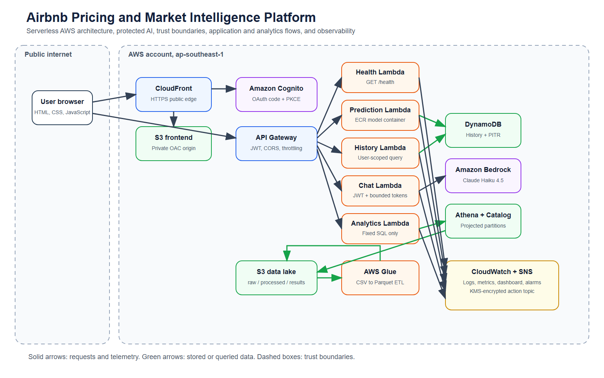

# <Project Title>

<!--
Entry point for the submission. Keep this concise and factual.
A marker should be able to understand the project and run safe, offline commands from here.
-->

## Problem statement

<One paragraph describing the user problem this service solves and who the users are.>

## Team members

| Name | Student ID | Role |
|------|-----------|------|
| <Name> | <ID> | <Role> |
| <Name> | <ID> | <Role> |
| <Name> | <ID> | <Role> |
| <Name> | <ID> | <Role> |

## Quickstart commands

```bash
# 1. Install dependencies
<command>

# 2. Configure environment (copy and fill placeholders)
cp src/.env.example src/.env

# 3. Run the application locally
<command>

# 4. Run tests
<command>
```

## Architecture



<Short description of the architecture. Labels here must match component names in source/config and evidence.>

## Technology list

- Cloud provider: <AWS | Azure | GCP | other>
- Compute/deployment: <VM | container service | managed platform>
- Data layer: <database / storage service>
- Analytics / AI-ML: <framework / notebook>
- Application: <language / framework>

## Known limitations

- <Limitation 1>
- <Limitation 2>
