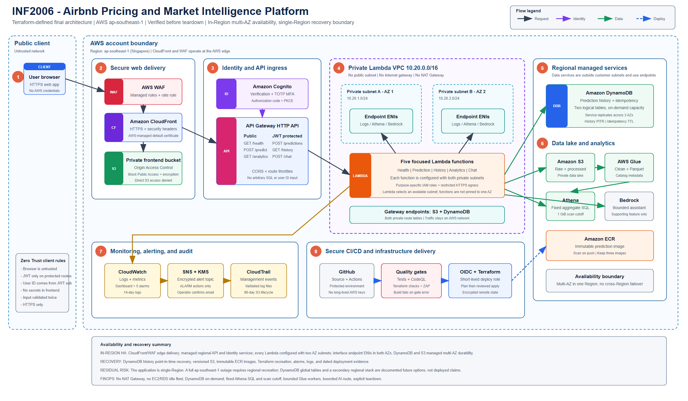

# Airbnb Pricing and Market Intelligence Platform

## Problem statement

Prospective and existing Airbnb hosts lack a simple way to estimate an appropriate nightly price and understand the surrounding market before listing or evaluating a property for hosting. Existing listing pages do not combine model-based scenario estimation, local market analytics, comparison of potential configurations, and private prediction history in one focused workflow. This platform helps users explore listing configurations and historical market patterns before deciding whether hosting may suit a property. It provides decision support, not property valuation, purchase advice, guaranteed demand, or predicted investment return.

## Team members

| Name | Student ID | Role |
|------|-----------|------|
| Lum Jia Jun | 2500022 | Cloud Alternatives and Portability Reviewer |
| Nixon Lee Disheng | 2500594 | Infrastructure and Cloud Deployment Lead |
| Madugula Adheesh | 2500670 | Application and Data Prototype Contributor |
| Leow Yi Hao Ignatius | 2501538 | Application QA and Presentation Reviewer |
| Wong Zhen Ho Brendan | 2503427 | Frontend Navigation and Test Contributor |

## Deployment status

The development stack was rebuilt and verified in `ap-southeast-1` on
2026-10-04 after the 46-test local preflight passed, then decommissioned that
evening to stop temporary project costs. The final destroy-only plan contained
no create/update actions, the application state is empty, and post-destroy AWS
checks found no matching application resources. The separate encrypted remote
Terraform backend was retained for controlled recreation. See
`evidence/cloud-verification-2026-10-04.md`,
`evidence/chatbot-accuracy-2026-10-04.md`, and
`evidence/teardown-2026-10-04.md`.

## Quickstart commands

For the full team handoff, shared Terraform workflow, cleanup safety, and
remaining workstreams, see `TEAM_WORK_GUIDE.md`.

For the offline submission path, install Python 3.11 or newer, Node.js 24, and
Terraform 1.10 or newer. The local website and synthetic model require no AWS
account and have no cloud cost. Cloud deployment additionally requires AWS CLI
v2, Docker, an AWS account with permission to create the declared resources,
the external full dataset described in `data/README.md`, and an initialized
Terraform backend. The original low-traffic core estimate was USD 4-7 per
month, but the assessed two-AZ interface endpoints and WAF add fixed charges;
review `evidence/cost-estimate.md` and current AWS pricing before deployment,
then destroy temporary resources promptly.

```bash
# 1. Install the pinned local test and ML dependencies
python -m pip install -r tests/requirements.txt

# 2. Initialise Terraform providers without a cloud backend
terraform -chdir=src/infrastructure init -backend=false

# 3. Run the complete offline preflight, including synthetic ML training
python tests/local_preflight.py --include-ml

# 4. Run the website and representative APIs locally
python src/local_server.py

# 5. Validate Terraform independently
cd src/infrastructure
terraform fmt -check
terraform validate

# 6. Optional authorized cloud review; this requires AWS credentials
terraform plan
```

Do not apply from the `-backend=false` initialization above. For an authorized
deployment, create the ignored `backend.hcl`, reinitialize the encrypted shared
backend, review the plan, and apply by following `src/infrastructure/README.md`.

For an authorized deployed account, `tests/verify_cloud.ps1` repeats Terraform
formatting and validation, requires a zero-drift plan, runs the public smoke
workflow, and checks Lambda state, private-subnet attachment, alarms,
CloudTrail, DynamoDB recovery, Glue, S3 public-access blocks, CloudFront WAF,
and SNS subscription status. Its generated Markdown omits cloud identifiers,
URLs, operator addresses, tokens, and credentials.

### Local website mode

Install `tests/requirements.txt`, then run `python src/local_server.py` from the
repository root. The command prepares the deterministic sample model when
needed, opens `http://127.0.0.1:8000`, and serves the real frontend with local
health, analytics, model-schema, and prediction routes. No AWS credentials are
required. Stop it with `Ctrl+C`.

Local mode is intentionally labelled in the navigation and uses synthetic
data. Cognito sign-in, private history, Bedrock chat, WAF, CloudFront, VPC
endpoints, alarms, and other managed-service controls remain AWS integration
tests rather than local simulations.

## Architecture



The compact diagram above is intended for the report. A larger
[detailed trust and service-flow diagram](evidence/architecture-detailed.png)
shows the route authorization contract, both private subnets, Lambda VPC
attachment, gateway and interface endpoints, managed service plane, offline
data pipeline, monitoring, and CI/CD control plane. It deliberately does not
show AgentCore, ALB, NAT Gateway, containers, or third-party identity services
because those components are not deployed in this project.

CloudFront serves a static frontend from a private S3 origin. The frontend calls an API Gateway HTTP API, which invokes focused Lambda functions. `GET /health`, `POST /predict`, and `GET /analytics` are public. Cognito protects `POST /predictions`, `GET /history`, and the Claude Haiku-backed `POST /chat` route. AI traffic uses a separate Lambda and tighter route throttle so it can be cost-controlled independently from prediction traffic. The assistant receives a compact server-controlled set of verified platform facts and only the signed-in user's ten latest DynamoDB prediction records; DynamoDB is not treated as a general knowledge base. History is explicitly ordered newest first, mixed-currency comparisons are blocked, model temperature is zero, and plain-text output is bounded to 120 words. Authenticated predictions retain the safe listing and host signals needed for useful follow-up questions while excluding coordinates. The estimator also offers bounded what-if predictions for amenities, guest capacity, and superhost status; these are model scenarios, not future-price forecasts. The evaluated model runs from an ECR-backed Lambda container. Glue converts the raw listing CSV into city-partitioned Parquet in a separate private S3 data lake, and the analytics Lambda runs a fixed aggregate query through Athena.

The current Terraform design places all five Lambda functions in private subnets across two availability zones. It uses S3 and DynamoDB gateway endpoints plus private interface endpoints for CloudWatch Logs, Athena, and Bedrock Runtime. There is deliberately no NAT Gateway: the functions only require the AWS services covered by those endpoints. DynamoDB remains an AWS-managed regional service rather than a resource placed inside the customer VPC; see `evidence/aws-serverless-reference-review-2026-09-28.md`. CloudFront is protected by a global WAF ACL, and a regional management CloudTrail writes validated logs to a dedicated S3 bucket; see `evidence/edge-security-2026-09-29.md`.

Cognito uses email verification, a strong password policy, authorization-code flow with PKCE, token revocation, and required TOTP authenticator-app MFA. The application never handles passwords or MFA secrets.

## Technology list

- Cloud provider: AWS
- Compute/deployment: API Gateway and AWS Lambda, provisioned with Terraform
- Networking: two-AZ private Lambda VPC with S3/DynamoDB gateway endpoints and Logs/Athena/Bedrock interface endpoints
- Frontend: private Amazon S3 origin and Amazon CloudFront
- Identity and data: branded Cognito Managed Login v2 and encrypted Amazon DynamoDB prediction history
- Data engineering: private Amazon S3 data lake, AWS Glue, Parquet, Glue Data Catalog, and Amazon Athena
- Operations: CloudWatch structured logs, metrics, dashboard and alarms with an encrypted SNS action topic
- Delivery: GitHub Actions CI/CD, CodeQL SAST, OWASP ZAP DAST, and a manual-dispatch OIDC deployment workflow designed for environment approval
- Analytics / AI-ML: reproducible scikit-learn price regression pipeline plus a bounded Amazon Bedrock Claude Haiku 4.5 assistant
- Application: HTML, CSS, JavaScript, and Python

### Cloud service-model classification

- Deployment model: AWS public cloud in `ap-southeast-1`.
- FaaS: five AWS Lambda functions provide request-driven compute without managed servers.
- Managed PaaS/serverless data and application services: API Gateway, S3, DynamoDB, Cognito, Glue, Athena, Bedrock, CloudFront, WAF, CloudWatch, SNS, and KMS.
- IaaS networking: the team configures the VPC, two private subnets, route tables, security groups, and VPC endpoints, but no EC2 virtual machines are operated.
- SaaS delivery tooling: GitHub and GitHub Actions host source control and CI/CD outside the AWS runtime.
- Container packaging, not CaaS: ECR stores the Lambda inference image; ECS, EKS, Fargate, and Kubernetes are not used.

These labels describe responsibility boundaries rather than claiming that every managed AWS product fits only one service-model category.

## Analytics decision flow

The interface presents four bounded forms of analysis without overstating what
the cross-sectional dataset supports:

1. **Descriptive:** Athena returns listing count, average and median nightly
   price, and average rating for each city.
2. **Diagnostic:** the same governed query reports average-to-median shape,
   capacity-price correlation, and the observed superhost/non-superhost price
   difference. These are associations, not evidence that a feature causes a
   price change.
3. **Predictive:** the evaluated regression pipeline estimates a nightly price
   for a validated listing scenario and reports its local currency and model
   scope.
4. **Prescriptive:** the browser compares that estimate with the same-city
   historical median and suggests a cautious next comparison. It does not
   recommend an investment, promise demand, or optimize profit.

`data/sample/listings_synthetic.csv` and `python tests/local_preflight.py
--include-ml` provide a safe offline reproduction path. Synthetic-sample
metrics prove code execution only; the report uses the evaluated full-dataset
metrics.

## CI/CD and shared state

Pull requests and pushes to `main` or `nixon` run unit tests, Python compilation,
frontend syntax checks, secret-pattern checks, Terraform formatting and
validation. The security gates additionally run pinned dependency audits for
the application and analytics requirements plus Bandit Python static analysis;
CodeQL SAST covers Python and JavaScript. Deployment is manual,
requires typing `DEPLOY`, and is gated by the GitHub `development` environment.
The `Deploy development` workflow accepts only `main` or `nixon`, repeats the
application and Terraform validation before assuming AWS access, and targets
the GitHub `development` environment before it can apply the reviewed plan.
Required reviewers must be configured in the repository environment settings
before claiming human approval enforcement. The workflow uses GitHub OIDC
rather than stored AWS access keys.

After a successful deployment, OWASP ZAP DAST performs a passive baseline scan.
It can also be started manually. The scan accepts only HTTPS and requires the
target hostname to exactly match the allowlisted host, uploads HTML, JSON, and
Markdown reports, and fails on scanner errors plus new or explicitly actionable
findings. Narrowly accepted static-site findings are documented in
`.zap/rules.tsv` and must not be broadened without review.
Configure `AWS_DEPLOY_ROLE_ARN`, `TF_STATE_BUCKET`, `TF_STATE_KMS_KEY_ARN`,
`MODEL_ARTIFACT_S3_URI`, `ALERT_EMAIL`, `DAST_TARGET_URL`, and
`DAST_ALLOWED_HOST` in the protected GitHub environment before using deployment
or DAST. `ALERT_EMAIL` must contain the confirmed operator address so an
automated deployment preserves the Terraform-managed SNS subscription.

To deploy, open GitHub Actions, select `Deploy development`, choose `nixon` or
`main`, and type `DEPLOY`. Configure required reviewers in the `development`
environment first so GitHub pauses before the AWS apply step. The OIDC role
trust policy must allow only this repository and the `development` environment;
do not replace this with long-lived AWS access keys.

The state bootstrap under `src/infrastructure/bootstrap` manages a private,
versioned S3 bucket encrypted with a rotating customer-managed KMS key. S3
lockfiles provide concurrency control. Terraform state is not stored in KMS or
Secrets Manager and no state, account ID, key ARN, or backend file is committed.

CloudFront already provides HTTPS on its generated domain using an AWS-managed
certificate. ACM becomes useful only after the team owns a custom domain and
can complete DNS validation, so a custom certificate remains pending until
those domain details are supplied.

## Submission packaging

After committing the reviewed final files, create the marker ZIP from tracked
content rather than compressing the working directory. This excludes ignored
Terraform state, credentials, raw data, local caches, logs, and test output:

```bash
git archive --format=zip --output=../Group_G014_INF2006_Project.zip HEAD
```

Open the ZIP before submission and confirm that `README.md`,
`project_manifest.yaml`, `report.pdf`, `src/`, `data/`, `analytics/`,
`evidence/`, `tests/`, `TEAM_CONTRIBUTIONS.md`, and
`AI_USE_DECLARATION.md` are directly under the ZIP root.

## Known limitations

- A consented single-account browser journey covering sign-up, verification, TOTP MFA, prediction save, history retrieval, and protected chat is recorded in `evidence/test-functional.md`; a separate multi-user browser isolation test remains future work.
- Analytics now reports an average-to-median market-shape ratio so users can compare within-city price skew without pretending local-currency prices are globally comparable. User-currency conversion is intentionally not enabled because the dataset has no timestamped exchange-rate source.
- The city analytics use different local currencies and must not be compared as if they shared one currency.
- The dataset is a cross-sectional listings snapshot, not a price or demand time series. It supports listing-price estimation, descriptive summaries, and bounded diagnostic associations, not causal conclusions, future-price forecasting, or condition monitoring.
- The evaluated model has material error and supports only the typical 99% price range learned per city.
- A prediction cold start was measured at approximately 3.3 seconds with 2 GB Lambda memory in the initial manual check. A first request immediately after the 2026-10-03 clean rebuild exceeded the API response window, returned HTTP 503, and then completed in Lambda; the browser now retries one transient 502/503/504 response while showing a model-warming state.
- The development AWS account Lambda concurrency quota is now 1,000. API Gateway still throttles excess traffic, and bounded stress results are recorded in `evidence/test-resilience.md`.
- Authenticated prediction retries now use a server-side idempotency key; a separate cross-region recovery exercise remains future work.
- The SNS alert topic supports an operator-managed email subscription through the Terraform `alert_email` variable. The final live deployment omitted that variable to avoid alert noise, and the stack is now decommissioned; a future deployment must configure and confirm an operator endpoint before claiming active email delivery.
- The chatbot's 16-scenario evaluation checks known factual, history, arithmetic, privacy, injection, and scope cases but does not prove correctness for every possible question. Exact live analytics values remain on the Markets page rather than in assistant context.
- Cloud deployment requires an AWS account and may incur a small cost.
- Cost assumptions and EC2 comparisons are documented in `evidence/cost-estimate.md`.
- The original low-traffic estimate predates the two-AZ interface endpoints and WAF; the post-deployment FinOps addendum documents their fixed and variable costs.
