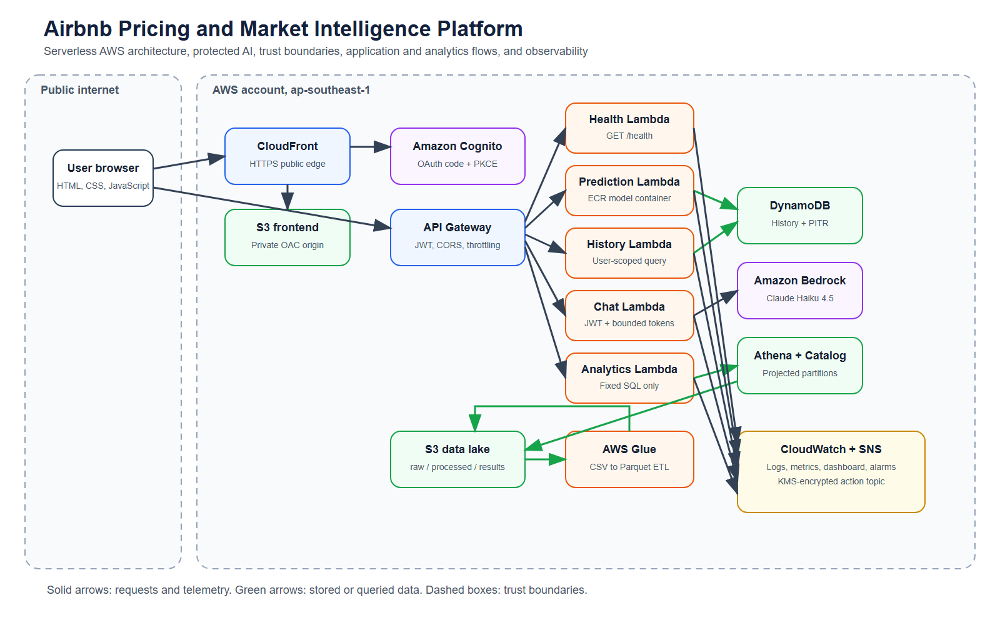

# Airbnb Pricing and Market Intelligence Platform

<!--
Entry point for the submission. Keep this concise and factual.
A marker should be able to understand the project and run safe, offline commands from here.
-->

## Problem statement

Airbnb hosts and prospective hosts can struggle to interpret local listing patterns and choose a reasonable nightly price. This project provides an estimated nightly price from listing characteristics, supported market analytics, and authenticated prediction history through a secure serverless AWS application. Predictions are estimates, not guaranteed market prices.

## Team members

| Name | Student ID | Role |
|------|-----------|------|
| Lum Jia Jun | 2500022 | |
| Nixon Lee Disheng | 2500594 | |
| Madugula Adheesh | 2500670 | |
| Leow Yi Hao Ignatius | 2501538 | |
| Wong Zhen Ho Brendan | 2503427 | |

## Deployment status

The evidence deployment was intentionally destroyed after testing to stop
ongoing charges. The main page remains the estimator and market dashboard, with
separate market and project pages, and can be recreated from Terraform after
the prediction model artifact is available.

## Quickstart commands

```bash
# 1. Run offline unit tests
python -m unittest discover -s tests -p "test_*.py" -v

# 2. Initialise and validate Terraform
cd src/infrastructure
terraform init -backend=false
terraform fmt -check
terraform validate

# 3. Review and deploy the infrastructure
terraform plan
terraform apply

# 4. Show the deployed endpoints
terraform output frontend_url
terraform output health_url
terraform output analytics_url
```

## Architecture



CloudFront serves a static frontend from a private S3 origin. The frontend calls an API Gateway HTTP API, which invokes focused Lambda functions. `GET /health`, `POST /predict`, and `GET /analytics` are public. Cognito protects `POST /predictions`, `GET /history`, and the Claude Haiku-backed `POST /chat` route. AI traffic uses a separate Lambda and tighter route throttle so it can be cost-controlled independently from prediction traffic. The assistant can query only the signed-in user's ten latest DynamoDB prediction records and supplies those records as bounded context; DynamoDB is not treated as a general knowledge base. Authenticated predictions are stored under the token-derived user identifier. The evaluated model runs from an ECR-backed Lambda container. Glue converts the raw listing CSV into city-partitioned Parquet in a separate private S3 data lake, and the analytics Lambda runs a fixed aggregate query through Athena.

## Technology list

- Cloud provider: AWS
- Compute/deployment: API Gateway and AWS Lambda, provisioned with Terraform
- Frontend: private Amazon S3 origin and Amazon CloudFront
- Identity and data: branded Cognito Managed Login v2 and encrypted Amazon DynamoDB prediction history
- Data engineering: private Amazon S3 data lake, AWS Glue, Parquet, Glue Data Catalog, and Amazon Athena
- Operations: CloudWatch structured logs, metrics, dashboard and alarms with an encrypted SNS action topic
- Delivery: GitHub Actions CI, CodeQL, Dependabot, and a manually approved OIDC deployment workflow
- Analytics / AI-ML: reproducible scikit-learn price regression pipeline plus a bounded Amazon Bedrock Claude Haiku 4.5 assistant
- Application: HTML, CSS, JavaScript, and Python

## CI/CD and shared state

Pull requests and pushes to `main` or `nixon` run unit tests, Python compilation,
frontend syntax checks, secret-pattern checks, Terraform formatting and
validation, and CodeQL. Deployment is manual, requires typing `DEPLOY`, and is
gated by the GitHub `development` environment. It uses GitHub OIDC rather than
stored AWS access keys. Configure `AWS_DEPLOY_ROLE_ARN`, `TF_STATE_BUCKET`,
`TF_STATE_KMS_KEY_ARN`, and `MODEL_ARTIFACT_S3_URI` as environment variables in
GitHub before using it.

The state bootstrap under `src/infrastructure/bootstrap` manages a private,
versioned S3 bucket encrypted with a rotating customer-managed KMS key. S3
lockfiles provide concurrency control. Terraform state is not stored in KMS or
Secrets Manager and no state, account ID, key ARN, or backend file is committed.

CloudFront already provides HTTPS on its generated domain using an AWS-managed
certificate. ACM becomes useful only after the team owns a custom domain and
can complete DNS validation, so no custom certificate or Route 53 zone is
provisioned for the current scope.

## Known limitations

- Full sign-up, email verification, prediction save, and history retrieval require a manual browser test with a real email account.
- The evidence deployment is currently offline and must be recreated before browser testing.
- The city analytics use different local currencies and must not be compared as if they shared one currency.
- The dataset is a cross-sectional listings snapshot, not a price or demand time series. It supports listing-price estimation and descriptive market analytics, not future-price forecasting or condition monitoring.
- The evaluated model has material error and supports only the typical 99% price range learned per city.
- A prediction cold start was measured at approximately 3.3 seconds with 2 GB Lambda memory; warm calls were below 100 ms in the initial manual check.
- The development AWS account has a concurrency quota of 10. A high-concurrency stress test caused Lambda throttles despite API Gateway rate limits; see `evidence/test-resilience.md`.
- The SNS alert topic has no human subscription in source control and needs an operator-managed confirmed endpoint.
- Cloud deployment requires an AWS account and may incur a small cost.
- Cost assumptions and EC2 comparisons are documented in `evidence/cost-estimate.md`.
